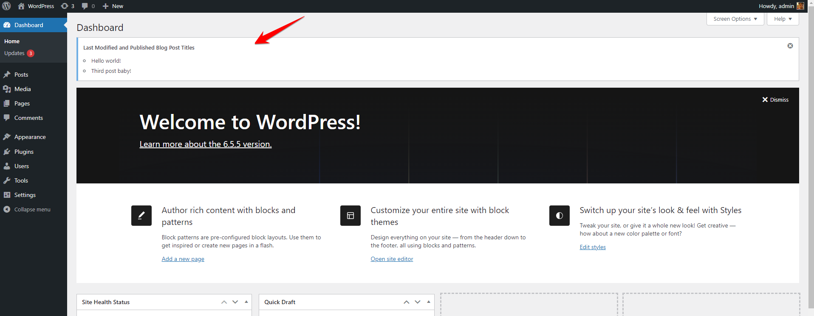
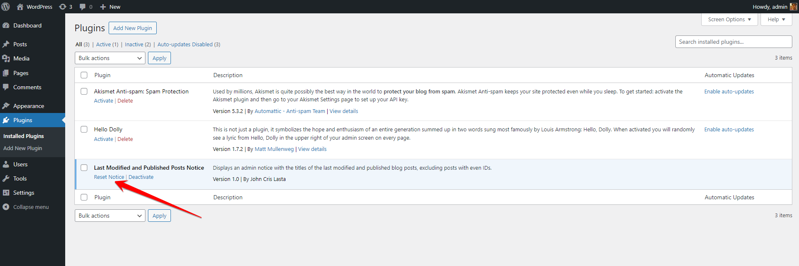

# Last Modified and Published Posts Notice
Contributors: John Cris Lasta
Tags: admin notice, blog posts, last modified, published posts
Requires at least: 5.0
Tested up to: 6.5.5
Stable tag: 1.0
License: GPLv2 or later
License URI: https://www.gnu.org/licenses/gpl-2.0.html

Displays an admin notice with the titles of the last modified and published blog posts, excluding posts with even IDs.

## Description

This plugin displays an admin notice with the titles of the last modified and published blog posts, excluding posts with even IDs. The notice is dismissible and will not show up again on refresh once dismissed. The notice can be reset using a link available in the plugin row.

## Installation

1. Upload the plugin files to the `/wp-content/plugins/last-modified-published-posts-notice` directory, or install the plugin through the WordPress plugins screen directly.
2. Activate the plugin through the 'Plugins' screen in WordPress.
3. The notice will automatically appear in the admin dashboard.

## Frequently Asked Questions

= How can I reset the dismissed notice? =

A "Reset Notice" link is available in the plugin row on the plugins page. Click this link to reset the notice.

## Screenshots

1. Admin Notice showing the last modified and published blog posts.
   
2. Plugin row with the "Reset Notice" link.
   

## Changelog

### 1.0
* Initial release.

## Upgrade Notice

### 1.0
* Initial release.

## License

This plugin is licensed under the GPLv2 or later.

## Contributing

1. Fork the repository.
2. Create a new branch for your changes.
3. Submit a pull request with your changes.
